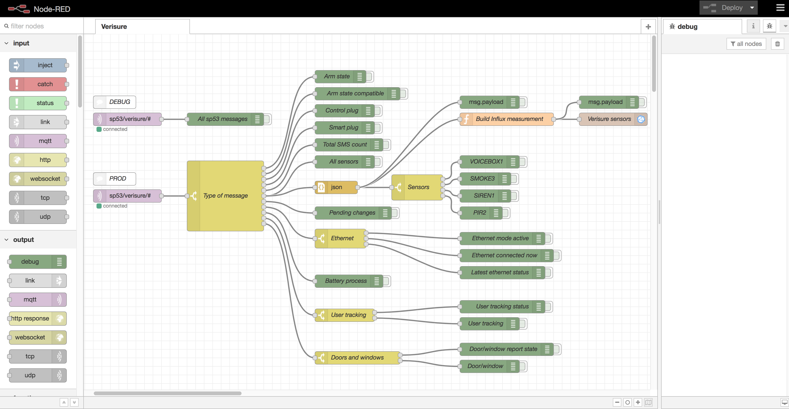
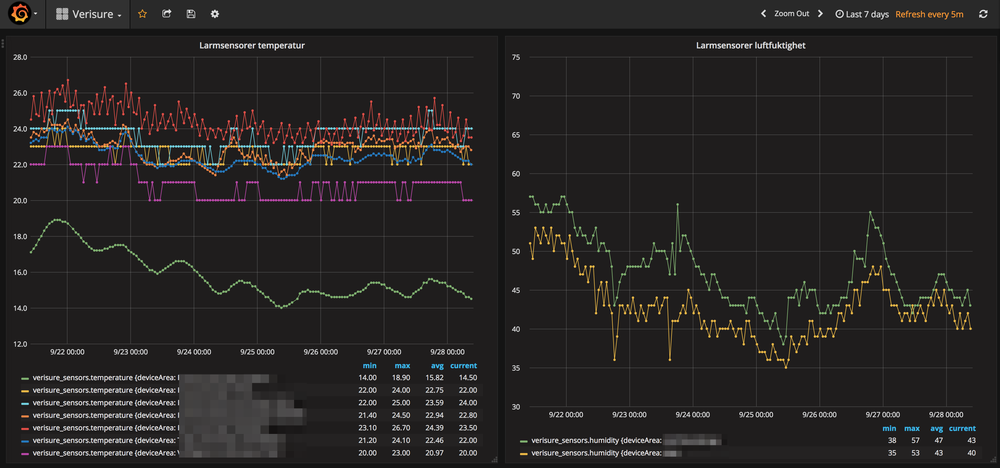

# verisure-to-mqtt-bridge

[](https://cloud.drone.io/mountaindude/verisure-mqtt)
[](https://codeclimate.com/github/mountaindude/verisure-mqtt/maintainability)

Dockerized Node.js app that queries Verisure's APIs for status and sensor readings, and then forwards this info to MQTT.  
Once the data has been injected into MQTT messages, it can be acted upon by any tool or system capable of subscribing to MQTT topics.  

What kind of data that is available from different Verisure devices vary, but many of them (PIR, camera, smoke detectors etc) contain temperature and/or humidity sensors. These sensor readings can be logged and then provide useful long-term environmental information.

A very powerful use case is to use [Node-RED](https://nodered.org/) to automate various actions based on information retrieved from the alarm system.  

For example

* Turn on lamps, radio etc when someone arrives home and disarms (turns off) the alarm. Different actions could even be taken depending on who it is that turns off the alarm.
* Store the climate readings (temperature and humidity) taken by the various alarm sensors in a time-series database such as [InfluxDB](https://www.influxdata.com/time-series-platform/influxdb/).

The status JSON returned from Verisure is quite rich and includes both alarm related information (alarm state, status of door/window sensors), as well as temperature and humidity readings from the various devices in the system.  
  
It is easy to change th MQTT topics in case the current ones don't fit your needs.

***Note! Do NOT download and user master branch unless you know what you are doing. Instead use a suitable [release](https://github.com/mountaindude/verisure-mqtt/releases). This will avoid issues due to new development that may have been done on master branch, since the last release was made.***

## Changelog

### Version 1.2

* Updated dependencies.
* Switched to using Drone for building Docker images.

### Version 1.1

* Added support for door lock state (thanks André!).
* Move to use docker-compose 3.3. Minor changes in docker-compose.yml file.

### Version 1.0

* First release.

## Eye candy using InfluxDB and Grafana

Pushing the sensor readings to MQTT makes it possible to act on them from other systems. A Node-RED flow for taking the MQTT messages and storing them into InfluxDB can look like this:



While Node-RED was initially (and still is) positioned as a visual prototyping tool for IoT applications, it has over the past several years developed into a rock-solid platform that lots of people use for continuous data processing. It might not be solid enough for mission critical enterprise data, but it's not far away.  
For the purpose of collecting and acting on sensor data in a home setting, Node-RED is more than adequate.  
Oh, and Node-RED of course runs as a Docker container too.. making it a breeze to set up.

Once the data is stored in InfluxDB it can be visualised using Grafana och other similar tools. A Grafana dashboard showing temperatures and humidity can look like this:



## Querying Verisure's API

There is some rate limiting for the API, preventing too frequent calls.  

It is hard to say how often calls can be made, but given that climate sensors only update once per hour, the Node.js code in index.js is set to query the API every 10 minutes. This seems to work fine from a rate limiting perspective.

Some parts (e.g. info on door locks, heat pumps, cameras etc) of the data received from Verisure's API are not forwarded to MQTT. The reason is simply that I don't have access to such devices, and thus don't know what the associated JSON looks like.  
Please feel free to fork this repository and add the missing code if you have access to those missing devices.

## Dockerizing the Node.js app

For testing purposes [this guide](https://nodejs.org/en/docs/guides/nodejs-docker-webapp) is useful.  
A proper production deployment requires more work, but even the steps outlined below will be enough to test things up on a home server, NAS or similar.

### Build Docker image

```bash
cd /directory/where/node/app/is/stored
docker build -t mountaindude/verisure-mqtt .
```

### Run Docker image

```bash
docker run --name verisure-mqtt -d mountaindude/verisure-mqtt
```

Even better, use docker-compose. Adapt the docker-compose.yml file to your needs:

```yaml
# docker-compose.yml
version: '3.3'  
services:  
  verisure-mqtt:  
    image: mountaindude/verisure-mqtt
    container_name: verisure-mqtt  
    restart: always  
    environment:  
      - "VERISURE_DEBUG=true"
      - "MQTT_BROKER_HOST=<ip of MQTT broker>"  
      - "MQTT_BROKER_PORT=<port used by MQTT broker>"  
      - "MQTT_ROOT_TOPIC=myHouse/"  
      - "VERISURE_USERNAME=<username used to log into Verisure web service>"  
      - "VERISURE_PWD=<password used to log into Verisure web service"  
    logging:  
      driver: json-file  
```

Then run

```bash
docker-compose up
```

from the directory where docker-compose.yml is stored.

### Get shell inside running container

In case you want to see what's going on within the running container, you can attach to it:

```bash
docker exec -it verisure-mqtt /bin/bash
```

### Monitor console output within the running container

Watch all console output messages generated within the container called verisure-mqtt

```bash
docker logs verisure-mqtt -f
```

### Export image to file, for copying to new server

If you develop on one computer but then want to deploy your newly created Docker image to a server, you need to export it to a TAR file.

```bash
docker images  

# Take note of the id of the image you want to export
docker save -o ./verisure-mqtt.tar <id>  
```

### Import image into new server

Once you have an image in a TAR file, you can load it into Docker on some other machine.
An alternative to the steps below is to pubish the image to Docker Hub and thus make it generally available, but if that's too much work the steps below are quick and easy.

```bash
# Log into target server
# Copy verisure-mqtt.tar to temp folder on target server
docker load -i ./verisure-mqtt.tar  
docker images  

# Take note of the id of the newly loaded image. Then rename the image to something human readable
docker tag <image id> mountaindude/verisure-mqtt  

# Copy docker-compose.yml file to target server, then create and start a new container based on the image
docker-compose up  
```

### Use image on Docker Hub

If you don't want to build the Docker image yourself, it is also [available on Docker Hub](https://hub.docker.com/r/mountaindude/verisuremqtt/).

If the requested Docker image is not found locally, it will be requested from Docker Hub (or other image repository that you have configured/logged into).

This `docker-compose.yml` file will use the latest available image on Docker Hub. Make sure to define the MQTT and user credentials in it before running `docker-compose up`.

```yaml
# docker-compose.yml
version: '3.3'
services:
  verisure-mqtt:
    # Use image on Docker Hub
    image: mountaindude/verisure-mqtt:latest
    container_name: verisure-mqtt
    restart: always

    # Set debug flag to true to output all received info to console.
    # False will limit output to only mention that a query to the Verisure API is made
    environment:
      - "VERISURE_DEBUG=true"
      - "MQTT_BROKER_HOST=<ip of MQTT broker>"
      - "MQTT_BROKER_PORT=<port used by MQTT broker>"
      - "MQTT_ROOT_TOPIC=myHouse/"
      - "VERISURE_USERNAME=<username used to log into Verisure web service>"
      - "VERISURE_PWD=<password used to log into Verisure web service"
    logging:
      driver: json-file
```

Then run

```bash
docker-compose up
```

## Disclaimer

This repository and any code in it is provided as-is, the developer of this repository and the artefacts within it should not be held liable for any use of such artefacts or derivatives of them.

The Verisure API is not officially documented or supported by Verisure, and may change at any time.
Finally, security is important and you should properly think things through how you use your Verisure username and password, and take appropriate security measures if you decide to use them in a project like this. You are on your own, basically.